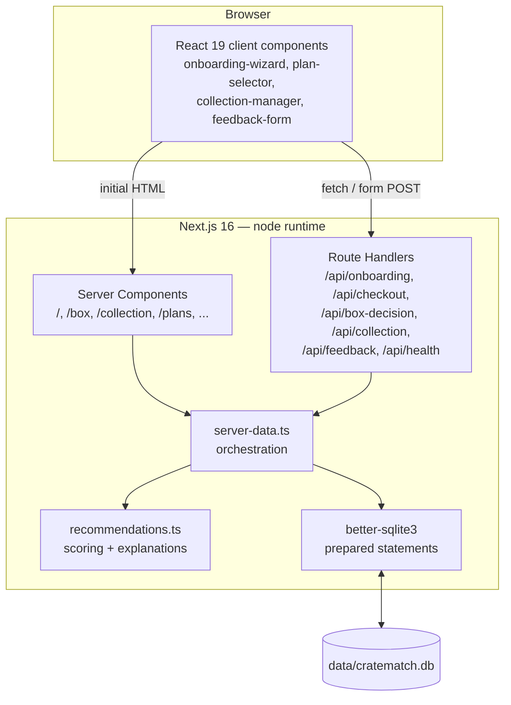
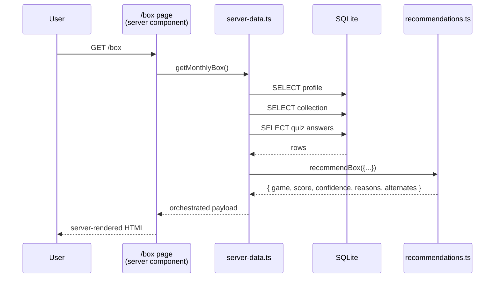

# Architecture

CrateMatch is a single Next.js 16 App Router application. There is no separate backend, no microservices, no message queue, and no cache layer. The recommendation engine is a pure TypeScript module called directly by server components.

## High-level diagram

## Layers

### `src/app/`

Next.js App Router. Each route directory contains a `page.tsx` (a server component), and `src/app/api/*/route.ts` contains route handlers for mutations.

- **Server components** fetch data directly via `server-data.ts`. No `useEffect` for data loading.
- **Route handlers** are `runtime = "nodejs"` (required by `better-sqlite3`), validate input rigorously, and call `persist*()` helpers.

### `src/components/`

Reusable UI. Client components are marked with `"use client"` only when they need interactivity or browser APIs. Each has its own error boundary via `component-error-boundary.tsx`.

### `src/lib/server-data.ts`

The orchestration layer. Pages call functions like:

- `getMonthlyBox()` — loads profile + collection, runs the engine, returns the pick + alternates.
- `getCollectionInsights()` — builds gap analysis and complementary suggestions.
- `persistOnboarding()`, `persistPlan()`, `persistCollection()`, `persistBoxDecision()`, `persistFeedback()` — all mutations.

This layer is the boundary between the engine (pure functions) and the database (side effects).

### `src/lib/recommendations.ts`

The engine. Pure functions, no I/O, no Date.now(). Given identical inputs, returns identical outputs. See [Recommendation Engine](./recommendation-engine.md).

### `src/lib/db/`

SQLite access via `better-sqlite3`. Connection is opened once at module load. All queries use prepared statements. Mapper functions translate row shapes to typed objects.

### `src/lib/catalog/`

Static, in-repo data: the 65-game catalog (`games.ts`), the three plan definitions (`plans.ts`), and theme/mechanic constants (`constants.ts`).

## Data flow: a monthly box request

No client-side data fetching. The page is fully rendered on the server, hydrated in the browser for interactivity (decision buttons).

## Why SQLite

- **Zero setup.** No Docker, no `pg_ctl`, no connection string to manage.
- **Single-file persistence.** Easy to inspect, easy to reset (`rm data/cratematch.db`).
- **Synchronous prepared statements.** `better-sqlite3` is meaningfully faster than async drivers for the low-concurrency MVP workload.
- **Deterministic seeding.** The seed module runs on first connection if the schema is missing or stale.

For a production deployment with multiple concurrent writers, this would need to change. See [Deployment](../guides/deploy.md).

## Why no separate backend

The MVP's mutation surface is six route handlers, the read surface is a handful of pages, and the engine is pure. A second process would add operational overhead without buying anything. When the engine grows (e.g. cross-subscriber signals, real ML), a worker boundary makes sense — until then, the monolith is the right call.
