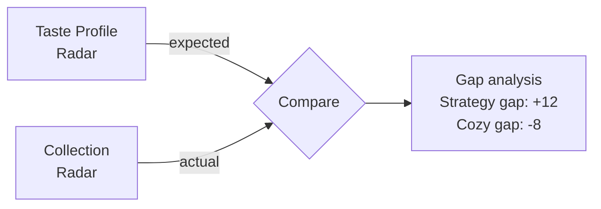

# Collection Intelligence

A subscriber's collection is treated as a first-class input, not metadata. It influences three things: what gets picked, what's safe to pick, and what's missing from the shelf.

## What "collection" means

The `collection` table stores `(userId, gameSlug)` pairs — games the subscriber currently owns, whether kept from a previous crate or added manually. The collection dashboard at `/collection` lets the subscriber:

- Search the catalog (`POST /api/collection`)
- Remove an entry (`DELETE /api/collection`)
- See gap analysis and complementary suggestions

## Three behaviors derived from the collection

### 1. Duplicate prevention (hard filter)

Any game already in the collection is removed from the candidate pool before scoring. No exceptions — the engine cannot suggest something the subscriber already owns.

### 2. Complementary suggestions (positive signal)

The collection dashboard surfaces games that share themes or mechanics with what's already owned, but aren't yet on the shelf. These are computed by `buildCollectionInsights()` and rendered as cards with a one-line "why":

> *Pair with Wingspan: shares the engine-building backbone but adds a heavier economy layer.*

These suggestions are **read-only** — they don't affect monthly box picks. They exist to spark exploration between deliveries.

### 3. Gap analysis (radar deltas)

The dashboard renders the same radar chart used in onboarding, but computed from the collection rather than the taste profile. Side-by-side, the deltas reveal which dimensions are over- or under-represented:

If your profile leans cozy but your shelf is 90% strategy, the gap analysis surfaces that — and the next monthly pick will trend cozy without any extra input from you.

## Why this matters

A subscription that ignores the collection is roulette. A subscription that respects it becomes an active curator: every box fills a gap, complements a strength, or extends a category the subscriber already enjoys.

This is the single biggest reason a content-based recommender beats a popularity-based one for a hobby with deep personal preferences. Every subscriber's collection is different, and the engine adapts to it without any retraining.

## Implementation pointers

- `src/lib/recommendations.ts` — filtering and scoring (uses `collectionSlugs`).
- `src/lib/server-data.ts` — `getCollectionInsights()` orchestrates the dashboard data.
- `src/app/collection/page.tsx` — server component that reads the collection and renders the manager.
- `src/components/collection-manager.tsx` — client component for add/remove.
- `src/app/api/collection/route.ts` — `POST` (add) and `DELETE` (remove) handlers.
