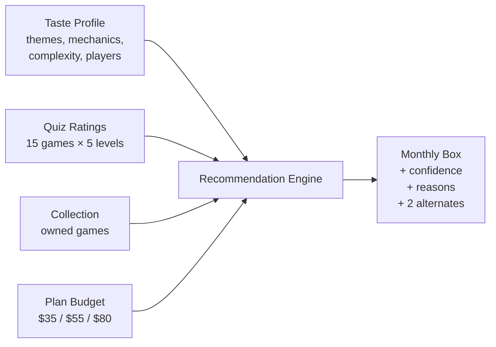

# Core Concepts

CrateMatch turns four inputs into one explainable monthly box:

Each input is a first-class concept worth understanding on its own:

- **[Taste Profile](./taste-profile.md)** — what the wizard captures and why each field exists.
- **[Recommendation Engine](./recommendation-engine.md)** — the scoring math, weights, filters, and explanation generation.
- **[Collection Intelligence](./collection-intelligence.md)** — how owned games guard against duplicates and surface complementary picks.
- **[Architecture](./architecture.md)** — Next.js App Router, server data orchestration, and the SQLite persistence layer.

## The two questions CrateMatch answers

Every layer of the codebase is in service of two questions:

1. **Which game ships this month?** Highest-scoring candidate within the plan budget, not in the collection, not too similar to a disliked game.
2. **Why this game?** Theme overlap, mechanic affinity, loved-game lookalikes, complexity fit, player-count fit — generated as plain text alongside the pick.

A black-box recommender could answer #1. CrateMatch is opinionated about answering #2 — because subscribers who understand a pick are more likely to keep it.

## What CrateMatch is *not*

- **Not a real subscription billing platform.** Checkout is a mock — it persists a plan choice without charging anything.
- **Not a real fulfillment system.** Box history is simulated; there's no warehouse, no logistics, no shipping integration.
- **Not an ML recommender.** Scoring is deterministic and content-based. No model weights, no training, no embeddings — every component of every score is explainable.

This focus is deliberate: the MVP exists to validate curation quality and explainability, not logistics.
