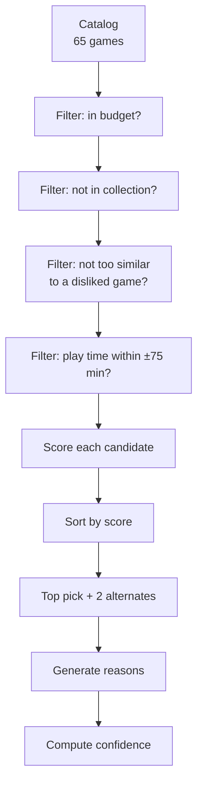

# Recommendation Engine

The engine lives in `src/lib/recommendations.ts`. It is deterministic, content-based, and fully explainable — no model, no embeddings, no external API calls.

## The pipeline



## The base score

Every surviving candidate starts at **22** points, then accumulates bonuses:

| Signal | Bonus | Notes |
|--------|-------|-------|
| Theme overlap with profile | **+18** per theme | Strongest single signal alongside mechanics. |
| Mechanic overlap with profile | **+20** per mechanic | The heaviest signal. |
| Theme overlap with loved games | **+16** per theme | Pulls candidates toward titles you already love. |
| Mechanic overlap with loved games | **+18** per mechanic | Same idea, mechanic dimension. |
| Player-count fit | up to **+10** | Linear within a ±4 tolerance window. |
| Play-time fit | up to **+10** | Linear within a ±90 minute tolerance window. |
| Complexity fit | up to **+12** | Linear within a ±2.2 tolerance window. |
| Theme overlap bonus (any) | **+10** per theme | Applies on top of profile theme bonus. |
| Mechanic overlap bonus (any) | **+18** per mechanic | Applies on top of profile mechanic bonus. |
| Supporting loved title (similarity > 16) | **+8** per title | Creates the "similar to games you loved" reason. |

These weights live as `const` records (`LIKED_WEIGHTS`, `SIMILARITY_WEIGHTS`, `SCORING`, `RADAR`, `FILTER`, `SIMILARITY_TOLERANCES`) at the top of `recommendations.ts` — they are the engine's tunable surface area.

## The filters

A candidate is rejected before scoring if any of these fail:

1. **Budget** — `price ≤ planBudget + 8`.
2. **Not in collection** — `slug ∉ ownedSlugs`.
3. **Dislike similarity** — for every disliked game, similarity score must be ≤ 55. Similarity uses theme + mechanic overlap and player/time/complexity proximity.
4. **Play-time sanity** — `playTime ≤ idealPlayTime + 75`.

## Confidence

Confidence is a normalized 0–1 value derived from the raw score, the gap to the runner-up, and the number of supporting signals. The exact normalization function lives in `computeConfidence()` in `recommendations.ts`.

Rough interpretation:

| Confidence | Meaning |
|------------|---------|
| ≥ 0.8 | Strong, multi-signal match. Ship it. |
| 0.6 – 0.8 | Solid match. Likely a keeper. |
| 0.4 – 0.6 | Acceptable match, but worth surfacing alternates prominently. |
| < 0.4 | Weak match — the engine couldn't find a great fit within the plan budget. Consider broader themes/mechanics or a higher tier. |

## Reasons

After the top pick is chosen, the engine constructs human-readable reasons by inspecting the overlap sets:

```ts
const pick = recommendBox({ profile, quizAnswers, collectionSlugs, planBudget: 55 });

pick.reasons;
// [
//   "Strong overlap with themes you loved: nature, engine-building",
//   "Plays well at your ideal 3-player count",
//   "Similar in feel to Terraforming Mars, which you loved",
// ]

pick.overlaps;
// {
//   themes: ["nature", "engine-building"],
//   mechanics: ["set-collection", "variable-player-powers"],
//   likedTitles: ["Terraforming Mars", "Everdell"],
// }
```

Reasons are never templated from raw scores — they reference the specific games, themes, and mechanics that produced the pick. This makes them auditable.

## Alternates

The engine also returns the second- and third-best candidates as alternates. They're rendered on the `/box` page so a subscriber who doesn't connect with the primary pick can preview adjacent options without re-running the wizard.

## Determinism

Given identical inputs, the engine always returns identical output. There is no randomness, no time-based variance, and no hidden state. This is what makes the [seed snapshot system](../guides/seed-demo-data.md) work: a fixed taste profile produces a fixed sequence of monthly picks across the 8-month demo history.

## Tuning

To experiment with weights, edit the constants at the top of `src/lib/recommendations.ts` and rebuild. See [Tune the Scoring](../guides/tune-scoring.md) for a worked example.
