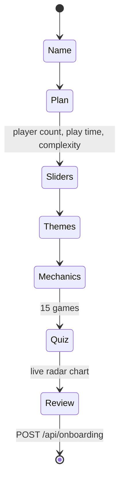

# Taste Profile

The taste profile is the persistent record of what a subscriber likes. It's the only personalization input that survives between sessions, and it directly shapes every monthly pick.

## Fields

```ts
interface UserProfile {
  userId: string;
  name: string;
  planId: "discovery" | "explorer" | "collector";
  idealPlayerCount: number;     // 1–8
  idealPlayTime: number;        // minutes, typically 30–180
  complexityTarget: number;     // BGG-style weight, 1.0–5.0
  onboardingComplete: boolean;
  billingStatus: "active" | "trial" | "paused";
}
```

In addition, the wizard persists two side tables:

- **Preferred themes** (up to 20) — e.g. `nature`, `fantasy`, `economics`, `space`, `social`.
- **Preferred mechanics** (up to 20) — e.g. `engine-building`, `worker-placement`, `deck-building`, `trick-taking`, `co-operative`.

And one ratings table:

- **Quiz answers** — 15 rows, one per quiz game, each tagged `loved | liked | neutral | disliked | unplayed`.

## Why these fields?

Each profile field maps to a distinct scoring contribution:

| Field | Drives |
|-------|--------|
| `idealPlayerCount` | Player-fit bonus (up to +10) when a candidate's range covers your ideal count. |
| `idealPlayTime` | Time-fit bonus (up to +10) within a ±75 minute tolerance. |
| `complexityTarget` | Complexity-fit bonus (up to +12), with a hard ±2.2 tolerance window. |
| `themes` | Per-theme overlap bonus (+10 per matching theme on a candidate). |
| `mechanics` | Per-mechanic overlap bonus (+18 per match — the heaviest single signal). |
| `quizAnswers` (loved) | Pulls similar games up; loved-game similarity drives the "supporting titles" reason. |
| `quizAnswers` (disliked) | Filters out candidates that are too similar (similarity > 55). |
| `planId` | Sets the candidate budget cap. |

See [Recommendation Engine](./recommendation-engine.md) for the full scoring math.

## How the wizard collects it

The onboarding wizard (`src/components/onboarding-wizard.tsx`) is a multi-step client component:



Each step is validated client-side, and the final submission is re-validated by the route handler before persistence — see [API Reference / Onboarding](../reference/api.md#post-apionboarding).

## The radar chart

The wizard renders a live preference radar chart (Recharts) computed by `buildRadarData()` in `src/lib/recommendations.ts`. The five dimensions are:

- **Strategy** — driven by strategy mechanics and complexity target.
- **Theme bias** — driven by selected themes.
- **Social** — driven by `co-operative` mechanic + `social` theme.
- **Adventure** — driven by adventure-leaning themes.
- **Cozy** — driven by cozy themes.
- **Discovery** — driven by loved + unplayed quiz answers (rewards openness to new games).

The chart re-renders on every preference change, giving the subscriber an immediate visual sense of how their answers shape their profile.

## Editing later

The wizard is a one-shot capture for the MVP. To re-onboard, delete the demo subscriber from `data/cratematch.db` and re-run the flow. A subsequent release is expected to add per-field editing — see [Roadmap](../why.md#whats-next).
