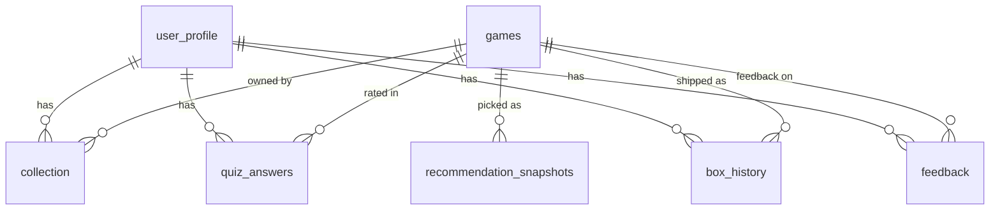

# Data Model

The SQLite schema is created on first connection by the seed module. All tables are owned by `src/lib/db/`.

## Tables



### `games`

The 65-game catalog, copied from `GAME_CATALOG` on seed.

| Column | Type | Notes |
|--------|------|-------|
| `slug` | TEXT PRIMARY KEY | kebab-case identifier |
| `title` | TEXT NOT NULL | |
| `year` | INTEGER NOT NULL | |
| `description` | TEXT NOT NULL | |
| `themes` | TEXT NOT NULL | JSON array |
| `mechanics` | TEXT NOT NULL | JSON array |
| `min_players` | INTEGER NOT NULL | |
| `max_players` | INTEGER NOT NULL | |
| `play_time` | INTEGER NOT NULL | minutes |
| `complexity` | REAL NOT NULL | 1.0–5.0 |
| `price` | INTEGER NOT NULL | USD |

### `user_profile`

The single-subscriber MVP stores one row.

| Column | Type | Notes |
|--------|------|-------|
| `user_id` | TEXT PRIMARY KEY | typically `"demo"` |
| `name` | TEXT NOT NULL | |
| `plan_id` | TEXT NOT NULL | `discovery` / `explorer` / `collector` |
| `ideal_player_count` | INTEGER | |
| `ideal_play_time` | INTEGER | |
| `complexity_target` | REAL | |
| `onboarding_complete` | INTEGER | 0 / 1 |
| `billing_status` | TEXT | `active` / `trial` / `paused` |

### `preferred_themes`, `preferred_mechanics`

Join tables for theme and mechanic preferences. Primary key `(user_id, value)`.

### `quiz_answers`

15 rows per subscriber, one per quiz game.

| Column | Type | Notes |
|--------|------|-------|
| `user_id` | TEXT | |
| `game_slug` | TEXT | FK → `games.slug` |
| `rating` | TEXT | `loved` / `liked` / `neutral` / `disliked` / `unplayed` |

### `collection`

Games the subscriber currently owns. `(user_id, game_slug, added_at)`.

### `box_history`

One row per monthly box shipped.

| Column | Type | Notes |
|--------|------|-------|
| `user_id` | TEXT | |
| `month_label` | TEXT | `YYYY-MM` |
| `game_slug` | TEXT | FK → `games.slug` |
| `decision` | TEXT | `keep` / `return` / `undecided` |
| `notes` | TEXT | optional |

### `recommendation_snapshots`

The full engine output saved at the moment a box was generated. Useful for offline analysis and debugging.

| Column | Type | Notes |
|--------|------|-------|
| `user_id` | TEXT | |
| `month_label` | TEXT | `YYYY-MM` |
| `game_slug` | TEXT | primary pick |
| `score` | REAL | raw score |
| `confidence` | REAL | 0–1 |
| `reasons` | TEXT | JSON array of explanation strings |
| `alternates` | TEXT | JSON array of `{slug, score}` |

### `feedback`

Post-delivery ratings.

| Column | Type | Notes |
|--------|------|-------|
| `user_id` | TEXT | |
| `box_month` | TEXT | `YYYY-MM` |
| `game_slug` | TEXT | |
| `rating` | INTEGER | 1–5 |
| `tags` | TEXT | JSON array |
| `comment` | TEXT | nullable, max 2000 chars |
| `submitted_at` | TEXT | ISO |

### `meta`

Schema and seed bookkeeping. The `seed_version` row drives reseeding when the seed module bumps it.

## TypeScript domain types

The canonical TypeScript shapes live in `src/lib/types.ts`:

```ts
export type RatingValue = "loved" | "liked" | "neutral" | "disliked" | "unplayed";
export type PlanId = "discovery" | "explorer" | "collector";
export type BoxDecision = "keep" | "return" | "undecided";

export interface Game { /* see catalog/games.ts */ }
export interface UserProfile { /* see above */ }
export interface QuizAnswer { gameSlug: string; rating: RatingValue; }
export interface BoxRecommendation {
  game: Game;
  score: number;
  confidence: number;
  reasons: string[];
  overlaps: {
    themes: string[];
    mechanics: string[];
    likedTitles: string[];
  };
}
```

Mapper functions in `src/lib/db/` translate between row shapes (snake_case columns, JSON-encoded arrays) and these typed objects.
